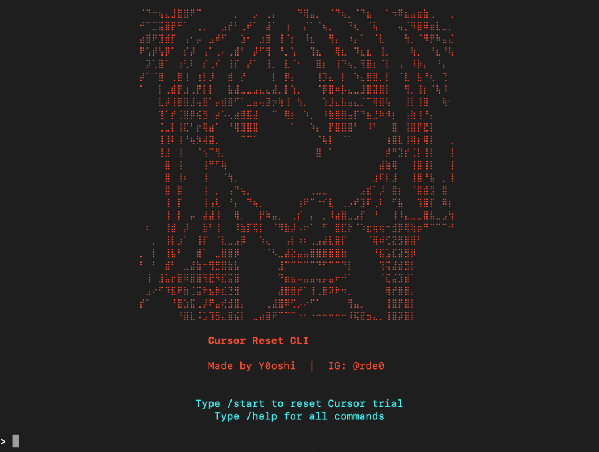

# Cursor Reset Tool



**Bypass Cursor IDE trial limits by resetting device fingerprints.**

Made by **Y0oshi** | Instagram: @rde0

---

## Features

- Resets all Cursor device identifiers
- Clears Local Storage and Session Storage databases
- **Resets Windows Registry MachineGuid** 
- Creates automatic backups before any changes
- Works with Cursor 2.x (latest versions)
- Cross-platform support (macOS, Windows, Linux)

---

## Quick Start

### One-Command Reset

1. **Sign out** of Cursor and close it.
2. Run the script:
   ```bash
   python3 cursor_reset.py
   ```
3. Sign in with a **new email address**.

### Interactive CLI

1. **Sign out** of Cursor and close it.
2. Run the CLI:
   ```bash
   python3 cursor_cli.py
   ```
3. Type `/start` to reset.
   > The tool will automatically regenerate your device IDs.
4. **Sign in** with a **new email address**.

---

## Requirements

- Python 3.8+
- **Windows Users**: Run as Administrator for Registry reset
- No external dependencies

---

## Files

| File | Description |
|------|-------------|
| `cursor_cli.py` | Interactive CLI with multiple commands |
| `cursor_reset.py` | Standalone aggressive reset script |

---

## How It Works

Cursor tracks devices using several identifiers stored locally:

1. **machineid** - Primary device fingerprint
2. **storage.json** - Contains telemetry IDs:
   - `telemetry.machineId`
   - `telemetry.macMachineId`
   - `telemetry.devDeviceId`
   - `telemetry.sqmId`
3. **Local Storage** - LevelDB database with trial data
4. **Session Storage** - Session-specific identifiers
5. **Windows Registry** - `MachineGuid` (Windows only)

This tool regenerates all identifiers, clears storage databases, and updates the registry (on Windows).

---

## Commands (CLI Mode)

| Command | Description |
|---------|-------------|
| `/start` | Full reset (recommended) |
| `/light` | Light reset (config files only) |
| `/status` | View current identifiers |
| `/help` | Show help menu |
| `/exit` | Exit the CLI |

---

## Backups

All original files are backed up to:
- **macOS**: `~/Library/Application Support/Cursor/backups/`
- **Windows**: `%APPDATA%\Cursor\backups\`
- **Linux**: `~/.config/Cursor/backups/`

---

## Troubleshooting

**Still showing trial limit?**
- Make sure you **signed out** before running the tool
- Use a NEW email address when signing back in
- Try running the aggressive reset (`/start` or `cursor_reset.py`)

**Permission denied?**
- Run with `sudo` on macOS/Linux
- Run as Administrator on Windows

---

## Disclaimer

This tool is provided for educational purposes only. Use responsibly.

---

## License

Made by Y0oshi | IG: @rde0
